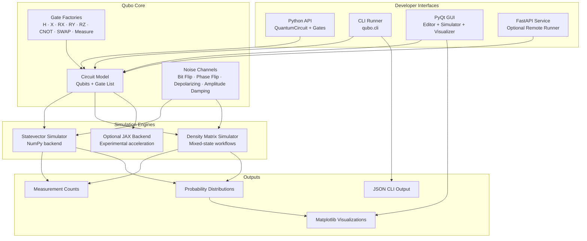
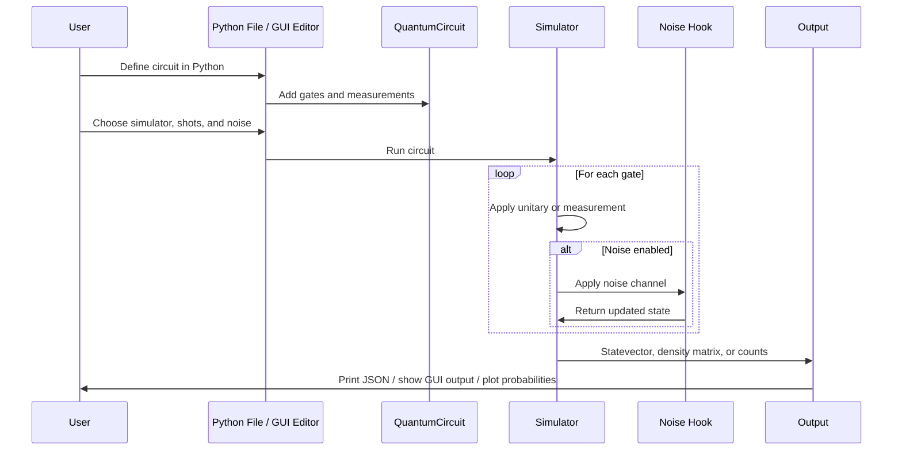

# Qubo — Quantum Development Toolkit


### Build, simulate, visualize, and experiment with quantum circuits locally.

> *"Create a Bell-state circuit, run it with 1024 shots, and inspect the probabilities."*
> Qubo gives you a small Python circuit API, statevector and density-matrix simulators, realistic noise channels, a desktop GUI, and a CLI workflow in one lightweight toolkit.

---

## The Problem

Quantum programming tools can be heavy, cloud-centered, or difficult to inspect when you are learning how circuits actually behave. Developers often need a fast local environment where they can:

- Build simple circuits in plain Python
- Run simulations without account setup or cloud latency
- Compare ideal and noisy behavior
- Visualize amplitudes, probabilities, and measurement outcomes
- Experiment with variational workflows and optional ML backends

**Qubo is designed for the local development loop: write a circuit, run it, inspect the result, adjust, and repeat.**

## The Solution

**Qubo** is a lightweight Python quantum toolkit for small-to-medium educational and developer workflows. It includes a developer-friendly circuit builder, modular gate factories, multiple simulator modes, noise models, visualization helpers, a CLI runner, and a PyQt GUI for interactive experimentation.

Qubo is intentionally compact. The core is readable, hackable Python, so you can inspect how gates are applied, how measurements are sampled, and how noise changes the resulting state.

---

## What’s Included

- `QuantumCircuit` builder API for Python developers
- Modular gate factories in `qubo.gates`
- `StatevectorSimulator` for pure-state simulation
- `DensityMatrixSimulator` for density-matrix workflows
- Noise models: bit-flip, phase-flip, depolarizing, amplitude damping
- Interactive PyQt GUI with live simulation output and probability charts
- CLI runner for script-based workflows
- Package entry point support via `python -m qubo`
- Lightweight `copilot` helpers for ML and variational experiments
- Optional JAX backend detection for acceleration experiments

---

## System Architecture



---

## How It Works — End-to-End Flow



---

## Core Concepts

### 1. Plain Python Circuit Builder

Qubo circuits are ordinary Python objects. You create a `QuantumCircuit`, add gates, and pass the circuit to a simulator.

```python
from qubo.circuit import QuantumCircuit
from qubo.gates import H, CNOT, Measure

qc = QuantumCircuit(2)
qc.add_gate(H(0))
qc.add_gate(CNOT(0, 1))
qc.add_gate(Measure(0))
```

### 2. Statevector Simulation

The statevector simulator tracks a complex vector of amplitudes and applies gates directly using NumPy.

```python
from qubo.simulator import StatevectorSimulator

sim = StatevectorSimulator(qc, seed=42)
result = sim.run(shots=1024)
print(result)
```

If the circuit contains a measurement gate, the result is a counts dictionary. Otherwise, the result is the final statevector.

### 3. Density Matrix Simulation

The density-matrix simulator supports mixed-state workflows and is useful when studying noisy channels or probabilistic states.

```python
from qubo.density import DensityMatrixSimulator

sim = DensityMatrixSimulator(qc)
rho = sim.run(shots=1024)
```

### 4. Noise Hooks

Noise can be applied during simulation using built-in channels:

| Noise Model | Purpose |
|-------------|---------|
| Bit-flip | Randomly applies an `X`-like error |
| Phase-flip | Randomly changes phase |
| Depolarizing | Mixes the state toward a more random state |
| Amplitude damping | Models energy loss from `|1>` toward `|0>` |

### 5. GUI Workflow

The GUI includes:

- A Python editor with a starter circuit
- Gate list and insert controls
- Statevector and density-matrix simulator selection
- Shot count control
- Noise model and strength controls
- Simulator output tab
- Matplotlib probability visualizer
- Copilot/ML experiment tab

---

## Installation

### Prerequisites

- Python 3.11+
- `pip`
- A desktop environment if you want to use the PyQt GUI

### Setup

From the repository root:

```bash
cd /Users/amitchauhanaiicloud.com/Downloads/qubo-main
python -m pip install -r requirements.txt
```

For editable development:

```bash
python -m pip install -e .
```

---

## Running Qubo

### Run the GUI

From the package directory:

```bash
cd /Users/amitchauhanaiicloud.com/Downloads/qubo-main/qubo
python gui.py
```

Or from the repository root:

```bash
python -m qubo.gui
```

### Run the CLI

```bash
python -m qubo.cli qubo/example_circuit.py --shots 1024 --json
```

### Select Density Matrix Simulation

```bash
python -m qubo.cli qubo/example_circuit.py --simulator density --shots 1024 --json
```

### Add Noise

```bash
python -m qubo.cli qubo/example_circuit.py --noise depolarizing --noise-prob 0.05
```

### Run Tests

```bash
pytest -q
```

---

## Example Workflows

| Workflow | Interface | What Qubo Does |
|----------|-----------|----------------|
| Build a Bell state | Python API | Applies `H` and `CNOT`, then simulates entanglement |
| Sample measurements | CLI / GUI | Runs shots and returns counts like `{"00": 512, "11": 512}` |
| Compare ideal vs noisy behavior | CLI / GUI | Applies selected noise channels during simulation |
| Visualize probabilities | GUI / Visualizer | Plots basis-state probabilities with Matplotlib |
| Try variational experiments | `qubo.copilot` | Uses parameter-shift helpers for small optimization loops |

---

## Developer API

Import the package directly:

```python
from qubo import QuantumCircuit, StatevectorSimulator, DensityMatrixSimulator
```

Build and run a circuit:

```python
from qubo.circuit import QuantumCircuit
from qubo.gates import H, X, Measure
from qubo.simulator import StatevectorSimulator

qc = QuantumCircuit(2)
qc.add_gate(H(0))
qc.add_gate(X(1))
qc.add_gate(Measure(0))

sim = StatevectorSimulator(qc, seed=123)
print(sim.run(shots=1024))
```

Draw a simple ASCII circuit:

```python
qc.draw()
```

---

## QUBO Copilot — ML / Deep Learning Integration

Qubo includes a lightweight `copilot` helper to bridge quantum experiments with common ML and deep-learning workflows.

Goals:

- Detect available ML frameworks such as PyTorch, JAX, and TensorFlow
- Provide `train_variational(...)` using the parameter-shift rule via `qubo.autodiff`
- Make it easier to wrap Qubo simulator calls inside custom training loops

Quick example:

```python
from qubo.copilot import detect_backends, train_variational
from qubo.circuit import QuantumCircuit
from qubo.gates import RX, Measure

print(detect_backends())

qc = QuantumCircuit(1)
qc.add_gate(RX(0, 0.2))
qc.add_gate(Measure(0))

def loss_fn(state):
    import numpy as np

    exp = 0.0
    for idx, amp in enumerate(state):
        bit = (idx >> 0) & 1
        val = 1.0 if bit == 0 else -1.0
        exp += val * (abs(amp) ** 2)
    return float(abs(exp))

hist = train_variational(qc, [0], loss_fn, epochs=6, lr=0.2)
print(hist)
```

---

## Project Structure

```text
qubo-main/
├── qubo/
│   ├── circuit.py             # QuantumCircuit and Gate model
│   ├── gates.py               # Gate factory helpers
│   ├── simulator.py           # Statevector simulator
│   ├── density.py             # Density-matrix simulator
│   ├── noise.py               # Noise channels
│   ├── visualizer.py          # Matplotlib plotting helpers
│   ├── gui.py                 # PyQt desktop GUI
│   ├── cli.py                 # CLI runner
│   ├── copilot.py             # ML / variational helpers
│   ├── service.py             # Optional FastAPI service
│   └── __main__.py            # python -m qubo entry point
├── examples/                  # Example scripts and notebooks
├── tests/                     # Unit tests
├── docs/                      # Documentation pages
├── requirements.txt
├── pyproject.toml
└── README.md
```

---

## Troubleshooting

### `ModuleNotFoundError: No module named 'qubo'`

Run commands from the repository root, install the package in editable mode, or use the GUI entry point from the `qubo/` directory:

```bash
python -m pip install -e .
```

### Matplotlib Cache Warnings

If your environment cannot write to the default Matplotlib cache directory, Qubo sets `MPLCONFIGDIR` to a writable temporary directory for GUI and visualizer imports.

### PyQt GUI Does Not Open

Check that PyQt5 is installed:

```bash
python -m pip install PyQt5
```

On headless or sandboxed environments, the GUI may not be able to connect to a display. The CLI and tests can still run without opening the desktop app.

### Tests Collect Non-Test Scripts

Pytest is configured to discover tests only from the `tests/` directory:

```toml
[tool.pytest.ini_options]
testpaths = ["tests"]
python_files = ["test_*.py"]
```

---

## Current Status

- Package exports are available in `qubo/__init__.py`
- Statevector and density-matrix simulation are implemented
- GUI supports simulator selection, shots, noise model, and noise strength
- Probability visualization supports statevectors, density matrices, and measured counts
- CLI supports JSON output, noise selection, seed selection, and simulator selection
- Test suite passes with `pytest -q`

---

## License

MIT

---

<p align="center">
  <b>Qubo keeps quantum experimentation small, local, and inspectable.</b>
</p>
# qubo2
